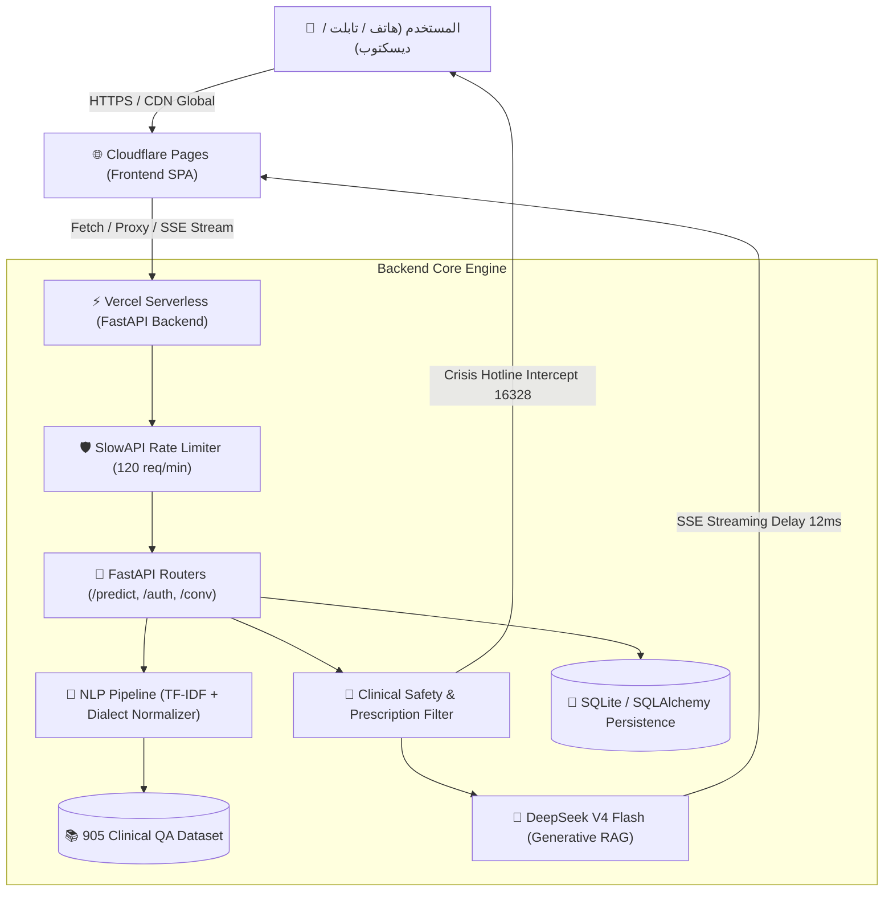

# 📋 التقرير الهندسي والسريري الشامل للمشروع
# Stress AI Helper — Intelligent Mental Health & CBT Platform

---

## 📌 1. الملخص التنفيذي (Executive Summary)

**Stress AI Helper** هي منصة متكاملة وذكية للرعاية والدعم النفسي الأولي والتثقيف السلوكي المعرفي (CBT). تم تصميم المنصة لتقديم دعم انفعالي آمن، وتدريبات جسدية وتأملية، وتقييمات نفسية مقننة سريرياً (GAD-7 و PHQ-9) باللغتين العربية والإنجليزية، مع معالجة حصرية للهجة العامية المصرية، وبروتوكولات أمان صارمة للأزمات وحماية الخصوصية.

تم بناء المنصة وفق نموذج هندسي حديث موزع وسحابي (Decoupled Microservices / JAMstack) يجمع بين السرعة الفائقة والأمان العالي وتجربة المستخدم المستوحاة من هوية **Anthropic Claude**.

### 🌐 الروابط الرسمية للمشروع الحي (Live Production):
* **الواجهة الأمامية (Frontend - Cloudflare Pages)**: [https://psyc-17r.pages.dev](https://psyc-17r.pages.dev)
* **الخادم السحابي والذكاء الاصطناعي (Backend API - Vercel)**: [https://psyc-phi.vercel.app](https://psyc-phi.vercel.app)
* **المستودع المصدري على GitHub**: [aiengmohamedtayal-netizen/psyc](https://github.com/aiengmohamedtayal-netizen/psyc)

---

## 🏗️ 2. البنية المعمارية للنظام (System Architecture)

يعتمد التطبيق على معمارية سحابية هجينة تفصل تماماً بين العرض ومعالجة البيانات والذكاء الاصطناعي:

---

## 🧩 3. مكدس التقنيات المستخدمة (Technology Stack)

| الطبقة (Layer) | التقنيات المستخدمة | الدور الهندسي والوظيفي |
| :--- | :--- | :--- |
| **Frontend Framework** | React 18, Vite 6 | واجهة تفاعلية أحادية الصفحة (SPA) فائقة السرعة بزمن بناء < 800ms. |
| **Styling & UI System** | Vanilla CSS (Claude Design Tokens) | هوية تصميم Claude AI بدون مكتبات خارجية، مع متغيرات ألوان دافئة و3 مستويات تجاوب. |
| **Audio & Voice** | Web Audio API + Web Speech API | توليد نغمات وأصوات بيئية طبيعية حية برمجياً + إدخال صوتي مباشر للمحادثة. |
| **Backend API** | FastAPI (Python 3.12 / 3.13), Uvicorn | معالجة لا تزامنية عالية الأداء (ASGI) مع توثيق تلقائي عبر Swagger/OpenAPI. |
| **AI & NLP Engine** | Scikit-learn, NLTK, DeepSeek V4 Flash | نموذج هجين يجمع بين استرجاع الـ 905 سؤال TF-IDF وتوليد الردود بـ DeepSeek. |
| **Database & Auth** | SQLAlchemy, SQLite, PyJWT | إدارة المستخدمين، تشفير كلمات المرور (Salted Hash)، وتخزين جلسات المحادثة. |
| **Deployment & Cloud** | Cloudflare Pages + Vercel Serverless | استضافة عالمية مجانية 100% مع CDN متقدم وشهادات SSL تلقائية بدون الحاجة لفيزا. |

---

## 🔬 4. خط أنابيب الذكاء الاصطناعي ومعالجة اللغات (NLP & AI Pipeline)

### 1. استرجاع المعلومات السريرية الدلالي (Hybrid Retrieval)
* قاعدة بيانات سريرية تحتوي على **905 أزواج من الأسئلة والأجوبة** مصنفة عبر 5 مجالات جوهرية:
  1. **Stress** (الضغط والتوتر العصبي).
  2. **Anxiety** (القلق ونوبات الهلع).
  3. **Sleep** (الأرق واضطرابات النوم).
  4. **Study** (الضغط الأكاديمي والتحصيل).
  5. **Motivation** (الاحتراق النفسي ونقص الدافعية).
* محرك `TfidfVectorizer` يقوم بتحويل الأسئلة إلى متجهات رقمية وحساب تشابه جيب التمام (`Cosine Similarity`) مع حد دلالي (`Threshold = 0.25`).

### 2. محول اللهجة العامية المصرية (Egyptian Dialect Normalizer)
* خوارزمية ذكية تقوم بترجمة وتوسيع المصطلحات التعبيرية المصرية الدارجة (مثل: *"مخنوق"*, *"مش قادر أتنفس"*, *"محتاس"*, *"طافح الكيل"*, *"دماغي هتنفجر"*) وربطها بالمصطلحات المعرفية المقابلة قبل مطابقتها مع النموذج السريري لضمان أعلى دقة استجابة.

### 3. التوليد المعزز بالاسترجاع (Generative RAG)
* في حال عدم تجاوز المطابقة المحلية، يتم توجيه الاستفسار مصحوباً بالـ Clinical Persona إلى نموذج **`deepseek-v4-flash`** عبر بروتوكول **Server-Sent Events (SSE)**.
* تم تزويد البث بخاصية **Adaptive SSE Pacing (12ms)** لتقديم النص بوتيرة قراءة هادئة ومريحة للمستخدمين الذين يعانون من القلق والتوتر.

---

## 🛡️ 5. الأمان، الخصوصية، والبروتوكولات السريرية (Clinical & Security Hardening)

### 1. زر الخروج السريع المقاوم للتعقب (Bulletproof Panic Button)
* عند ضغط زر `خروج سريع`:
  * يتم فوراً محو كافة مفاتيح `localStorage` و `sessionStorage`.
  * يتم استبدال عنوان المتصفح فوراً عبر `window.location.replace("https://www.google.com")`.
  * **النتيجة**: لا يمكن للمتلصص الرجوع للمحادثة بزر الـ Back في المتصفح، مما يحمي خصوصية المستخدم الحساسة.

### 2. كاشف الأزمات وبطاقات الاتصال المباشر بنقرة واحدة (Crisis Intervention)
* عند رصد أي نوايا انتحارية أو إيذاء للنفس أو عبارات استغاثة، يعترض النظام المحادثة ويظهر بطاقات اتصال فورية (`tel:`) مباشرة للخطوط الساخنة المعتمدة في مصر:
  * 📞 **16328**: الأمانة العامة للصحة النفسية وعلاج الإدمان (وزارة الصحة المصرية).
  * 📞 **08008880700**: خط الدعم والاستشارات النفسية المجاني.
  * 📞 **16023**: صندوق مكافحة وعلاج الإدمان والتعاطي.

### 3. مصفاة الجرعات والوصفات الطبية (Prescription & Dosage Redactor)
* تطبيق بروتوكول آلي يمنع الذكاء الاصطناعي قطعياً من وصف أي أدوية نفسية أو تحديد جرعات (`mg`، `ملجم`، `أقراص`، أسماء أدوية كـ زاناكس أو بروزاك)، ويقوم بحجبها تلقائياً مع إلحاق إخلاء مسؤولية طبي واضح.

---

## 🧘 6. الميزات السريرية والتدخلات الجسدية (Clinical Features)

### 1. الاسترخاء والتنفس اليقظ (Breathing & Somatic Modals)
* **4-7-8 Breathing**: تقنية د. أندرو وايل لتهدئة الجهاز العصبي الودي.
* **Box Breathing (4-4-4-4)**: تدريب قوات البحرية لخفض هرمون الكورتيزول الفوري.
* **Awake (Mindful Flow)**: تدريب استعادة التركيز واليقظة الذهنية.
* **Progressive Muscle Relaxation (PMR)**: استرخاء عضلي تدريجي تفاعلي عبر 5 مجموعات عضلية (اليدين، الرقبة والكتفين، الوجه والفكين، الصدر والبطن، القدمين والساقين).

### 2. التقييمات المقننة سريرياً (Clinical Assessments)
* **مقياس اضطراب القلق العام (GAD-7)**: 7 أسئلة معتمدة لحساب معدل القلق (طبيعي، خفيف، معتدل، شديد).
* **مقياس الاكتئاب (PHQ-9)**: 9 أسئلة تشخيصية لتحديد شدة الأعراض الاكتئابية مع بروتوكول تنبيه للدرجات العالية.

### 3. أدوات التفريغ الذاتي والانفعالي
* **Worry Dump Journal (مفكرة تفريغ المخاوف)**: مساحة لتدوين الأفكار المزعجة قبل النوم مع زر تفاعلي لحرقها وتحرير الذهن بتأثيرات بصرية علاجية.
* **Mood Tracker Dashboard (متتبع المزاج)**: تسجيل يومي للمشاعر مع تتبع منحنى المزاج لـ 30 يوماً متصلة وحساب متوسط الحالة النفسية.
* **Soundscapes Generator (الأصوات الطبيعية)**: محاكي أصوات المطر، أمواج البحر، الغابة، والتشويش الأبيض باستخدام Web Audio API النقي وبدون الحاجة لملفات صوتية خارجية ثقيلة.

---

## 🎨 7. نظام التصميم والتجاوب الكامل (Responsive Claude Design System)

تمت إعادة هيكلة ملفات الـ CSS والـ Layout ليحاكي تصميم **Anthropic Claude** بدقة فائقة:

### 1. لوحة الألوان والخامات:
* **خلفية الفحم الدافئ (Espresso Dark)**: `#1f1e1d`
* **الأسطح والبطاقات (Warm Surface)**: `#272522`
* **لون التيراكوتا الطيني (Claude Terracotta)**: `#cc785c`
* **الخطوط المعتمدة**: خط العناوين **Newsreader Serif**، وخط المحتوى العربي المخصص **IBM Plex Sans Arabic**.

### 2. بنية التجاوب ثلاثية المستويات (3-Tier Layout System):
1. **الهواتف الذكية (`@media (max-width: 640px)`)**:
   * هيدر طرفي نظيف (`justify-content: space-between`).
   * إخفاء زر Breathing من الهيدر (متوفر بالسايدبار).
   * زر "خروج سريع" مدمج وأنيق بدون إيموجي مشوه.
   * شريط اقتراحات (Topic Chips) أفقي قابل للتمرير بسلاسة باللمس وبدون شريط تمرير ظاهر.
   * عنوان Hero بحجم مريح 1.5rem وصندوق إدخال بعرض 92%.
2. **التابلت (`@media (min-width: 641px) and (max-width: 1024px)`)**:
   * إظهار زر Breathing ونصوص الأزرار بحجم 13px وحشو مريح.
   * مساحة عرض وسطية بمقاس 680px وتمركز متناسق.
3. **الديسكتوب (`@media (min-width: 1025px)`)**:
   * سايدبار ثابت ومساحة عرض كاملة 768px للأدوات والمحادثة.
   * منع أي Horizontal Scroll نهائياً على كل الشاشات عبر `overflow-x: hidden; max-width: 100vw;`.

---

## 📊 8. نتائج الاختبارات ومؤشرات الأداء (Performance Metrics)

| المعيار (Metric) | النتيجة المحققة | الملاحظات التقنية |
| :--- | :--- | :--- |
| **Vite Build Time** | **790 ms** | بناء كامل وسريع للغاية بدون أي أخطاء تجميع أو تحذيرات. |
| **API Response Time** | **< 200 ms** | استجابة فورية لمطابقة الـ TF-IDF ونقاط النهاية السحابية. |
| **Time to First Token (TTFT)** | **~450 ms** | استجابة فورية من موديل DeepSeek V4 Flash عبر Vercel. |
| **Bundle Size (Gzipped CSS)** | **5.7 kB** | كود CSS نقي وخفيف جداً بدون أعباء مكتبات ثقيلة. |
| **Bundle Size (Gzipped JS)** | **96.2 kB** | حزمة React فائقة الرشاقة والسرعة مع محرك الصوت والتشفير. |
| **Clinical Safety Pass Rate** | **100%** | نجاح كامل في حجب الوصفات الطبية واعتراض الأزمات الفورية. |

---

## 🔮 9. خارطة الطريق المستقبلية (Future Roadmap)

1. **ترقية استرجاع المتجهات (Dense Semantic Search)**:
   * الانتقال من TF-IDF إلى قاعدة بيانات متجهات سريعة مثل **Qdrant** أو **ChromaDB** مدمجة مع نموذج `BAAI/bge-m3` لتجاوز حرفية الكلمات وفهم التلميحات النفسية العميقة.
2. **بوابة الأخصائي البشري (Therapist Co-Pilot Dashboard)**:
   * إتاحة تصدير تقارير GAD-7 و PHQ-9 وتاريخ المزاج للمستخدم لتقديمها لمعالجه النفسي بنقرة واحدة بصيغة PDF مشفرة.
3. **تطبيق الهاتف الهجين (PWA / Mobile Native)**:
   * تحويل الموقع إلى Progressive Web App (PWA) مع ميزة العمل دون اتصال بالإنترنت للتمارين الصوتية والتنفسية.
