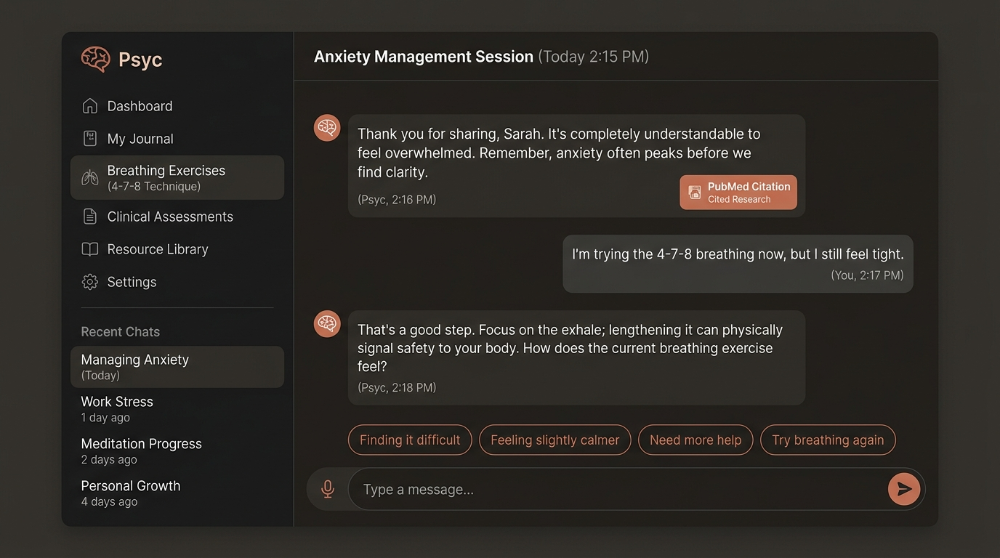
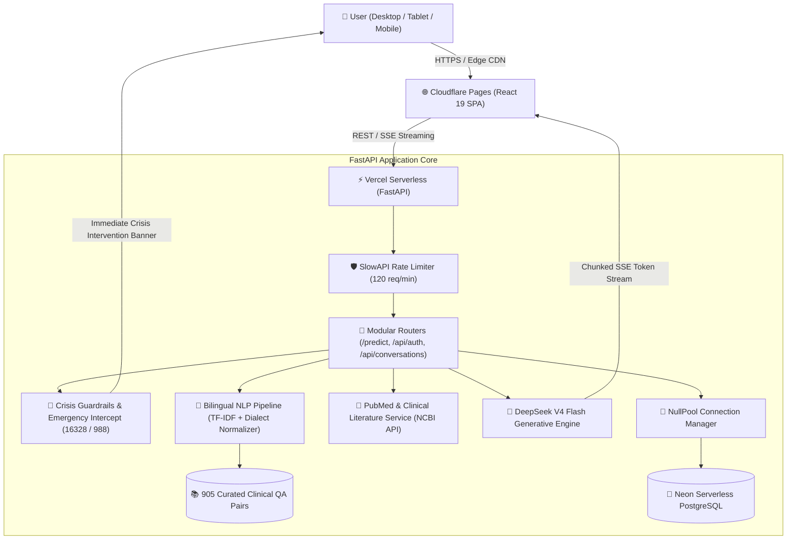

# Psyc — Intelligent Mental Health & Stress Companion

[](https://psyc-17r.pages.dev)
[](https://psyc-phi.vercel.app)
[](https://psyc-17r.pages.dev)
[](https://psyc-phi.vercel.app)
[](https://neon.tech)
[](LICENSE)

<p align="center">
  
</p>

**Psyc** is a production-grade, bilingual mental health and stress assistance platform built on cognitive behavioral therapy (CBT) principles, evidence-based psychiatric literature, and somatic grounding exercises.

Designed with an editorial, warm aesthetic inspired by Anthropic Claude, the application operates on a decoupled cloud architecture: an ultra-fast React 19 single-page application served via Cloudflare Pages edge CDN, communicating with an asynchronous FastAPI serverless backend on Vercel backed by Neon PostgreSQL.

---

## 🌐 Live Production Deployments

| Component | Platform | URL |
| :--- | :--- | :--- |
| **Frontend Application** | Cloudflare Pages | [https://psyc-17r.pages.dev](https://psyc-17r.pages.dev) |
| **Backend API Service** | Vercel Serverless | [https://psyc-phi.vercel.app](https://psyc-phi.vercel.app) |
| **Interactive OpenAPI Docs** | Swagger UI | [https://psyc-phi.vercel.app/docs](https://psyc-phi.vercel.app/docs) |
| **System & DB Health Check** | FastAPI Monitor | [https://psyc-phi.vercel.app/health/db](https://psyc-phi.vercel.app/health/db) |
| **Source Repository** | GitHub | [aiengmohamedtayal-netizen/psyc](https://github.com/aiengmohamedtayal-netizen/psyc) |

---

## 🏛️ System Architecture



---

## ✨ Core Capabilities

### 1. Bilingual Hybrid NLP & RAG Pipeline
- **Egyptian & Arabic Dialect Normalization**: Custom preprocessor that standardizes colloquial Egyptian phrasing (`مخنوق`, `مش عارف انام`, `تايه`, `قلقان`) and Modern Standard Arabic prior to vectorization.
- **TF-IDF & Cosine Similarity Matcher**: Sub-5ms retrieval across a domain-specific dataset of 905 clinically vetted question-answer pairs covering Anxiety, Stress, Insomnia, Motivation, and Academic pressure.
- **DeepSeek V4 Flash Generative Layer**: Contextual, empathetic response generation framed strictly within cognitive behavioral therapy (CBT) methodology.
- **Real-Time Token Streaming**: Server-Sent Events (SSE) streaming delivering conversational output with realistic human typing cadence and pulsing cursor feedback.

### 2. Evidence-Based Clinical Grounding
- **Automated PubMed / NCBI Integration**: Searches and cites peer-reviewed psychiatric studies directly matching user query topics.
- **Clinical Protocols**: Grounded in guidelines from the American Psychiatric Association (APA), National Institute of Mental Health (NIMH), and American Academy of Sleep Medicine (AASM).
- **Interactive Citation Cards**: Collapsible clinical references showing article title, PMC ID, and verified external DOI/PubMed links.

### 3. Somatic Grounding & Interactive Wellness Tools
- **Guided Breathing Modals**: Guided visual pacing for 4-7-8 and Box Breathing techniques targeting vagus nerve stimulation.
- **Somatic Relaxation**: Step-by-step interactive flows for 5-4-3-2-1 Sensory Grounding and Progressive Muscle Relaxation (PMR).
- **In-Browser Ambient Audio DSP**: Real-time synthesized acoustic environments (Gentle Rain, Ocean Surf, 432Hz Zen harmonics) computed entirely in the browser using the Web Audio API without external audio assets.
- **Standardized Assessments**: GAD-7 (Anxiety), PHQ-9 (Depression), and ISI (Insomnia) screening tests with instant scoring and Markdown report export.
- **Worry Dump & Mood Tracker**: Daily emotional pulse logging with trajectory analytics and a symbolic worry release feature.

### 4. Resilient Offline-First Architecture
- Seamless fallback to `localStorage` when offline or unauthenticated.
- Cloud synchronization with Neon PostgreSQL upon authentication using salted PBKDF2 cryptography and signed JWT bearer tokens.
- Serverless-optimized connection pooling (`NullPool`) to eliminate database connection exhaustion during cold starts.

---

## 📁 Repository Structure

```text
frontend NLP project/
├── CHAT BOT/                           # React 19 Frontend (Vite)
│   ├── src/
│   │   ├── components/                 # Modular UI Components
│   │   │   ├── auth/                   # FormInput, AuthLoginForm, AuthSignupForm
│   │   │   ├── chat/                   # ChatHeader, MessageBubble, ClinicalCard, ChatInputArea
│   │   │   ├── sidebar/                # SidebarHeader, NavGroup, ConversationList, UserProfile
│   │   │   ├── AppModals.jsx           # Unified modal container
│   │   │   ├── AuthPage.jsx            # Authentication dialog
│   │   │   ├── ChatWindow.jsx          # Active conversation view
│   │   │   ├── Sidebar.jsx             # Responsive navigation drawer
│   │   │   ├── AssessmentModal.jsx     # Clinical questionnaires (GAD-7, PHQ-9, ISI)
│   │   │   ├── BreathingModal.jsx      # 4-7-8, Box, PMR, & Grounding modal
│   │   │   ├── AmbientSoundModal.jsx   # Web Audio synthesizer controls
│   │   │   ├── MoodTrackerModal.jsx    # Daily mood logging modal
│   │   │   ├── WorryDumpModal.jsx      # Mental decluttering box
│   │   │   └── SearchModal.jsx         # Global Ctrl+K conversation search
│   │   ├── hooks/                      # Custom React Hooks
│   │   │   ├── useConversations.js     # Thread management & cloud sync
│   │   │   ├── useChatStream.js        # SSE stream dispatcher & buffer
│   │   │   ├── useModalManager.js      # Modal state coordinator
│   │   │   ├── useSpeechRecognition.js # Web Speech API voice-to-text
│   │   │   ├── useSpeechSynthesis.js   # Browser SpeechSynthesis TTS
│   │   │   ├── useBreathingCycle.js    # Somatic timer engine
│   │   │   ├── useAuthForm.js          # Auth form state & validation
│   │   │   └── useEscapeKey.js         # Universal Esc listener
│   │   ├── services/                   # Business Logic & Infrastructure Services
│   │   │   ├── conversationService.js  # Local caching & REST cloud persistence
│   │   │   ├── chatStreamService.js    # SSE buffer parser & fallback fetch
│   │   │   ├── ambientAudioService.js  # Web Audio API sound synthesizer
│   │   │   ├── assessmentCalculator.js # Questionnaire clinical scoring logic
│   │   │   ├── moodStorage.js          # Mood trajectory records & analytics
│   │   │   ├── worryStorage.js         # Private note storage & burn audio sfx
│   │   │   ├── authService.js          # Authentication coordinator
│   │   │   ├── authStorage.js          # Local user state manager
│   │   │   └── authApi.js              # Remote auth HTTP client
│   │   ├── data/                       # Static Questionnaires & Categories
│   │   ├── utils/                      # Pure Markdown Exporters
│   │   ├── App.jsx                     # Composition Root
│   │   ├── main.jsx                    # Application Entrypoint
│   │   └── style.css                   # Claude-inspired CSS Design Tokens
│   ├── package.json
│   └── vite.config.js
│
├── backend/                            # FastAPI Backend Engine
│   ├── routes/
│   │   ├── predict.py                  # /predict, /predict/stream, /health, /topics
│   │   ├── auth_routes.py              # /api/auth/register, /login, /me
│   │   └── conversation_routes.py      # /api/conversations CRUD
│   ├── services/
│   │   ├── model_service.py            # TF-IDF vectorizer & Cosine Similarity
│   │   ├── llm_service.py              # DeepSeek client & safety filters
│   │   └── clinical_service.py         # PubMed NCBI literature client
│   ├── utils/
│   │   ├── security.py                 # PBKDF2 hashing, salt & JWT tokens
│   │   ├── dialect_mapper.py           # Egyptian Arabic dialect normalizer
│   │   └── preprocessing.py            # Text cleaning & tokenization
│   ├── database.py                     # SQLAlchemy Engine & get_db Dependency
│   ├── models.py                       # SQLAlchemy ORM Entities (User, Conv, Msg)
│   ├── main.py                         # FastAPI Server Entrypoint
│   └── test_api.py                     # Automated Integration Test Suite
│
├── api/
│   └── index.py                        # Vercel Serverless Entrypoint Handler
├── data/
│   └── data.json                       # 905 Clinically Reviewed QA Pairs
├── vercel.json                         # Vercel Deployment Configuration
├── requirements.txt                    # Python Production Dependencies
└── LICENSE                             # MIT License
```

---

## 🚀 Quickstart & Local Setup

### Prerequisites
- **Node.js** v18+ and **npm**
- **Python** 3.10+ (tested up to 3.13)
- Git

---

### 1. Backend Setup

```bash
# Navigate to the repository root
cd "frontend NLP project"

# Create and activate a Python virtual environment
python -m venv venv
# On Windows:
venv\Scripts\activate
# On macOS / Linux:
source venv/bin/activate

# Install dependencies
pip install -r requirements.txt

# Create a local .env file
cp .env.example .env   # Or set DATABASE_URL, LLM_API_KEY, etc.
```

#### Run Backend Server:
```bash
uvicorn backend.main:app --host 127.0.0.1 --port 8000 --reload
```
API Documentation will be live at: [http://127.0.0.1:8000/docs](http://127.0.0.1:8000/docs)

#### Run Backend Test Suite:
```bash
python backend/test_api.py
```

---

### 2. Frontend Setup

```bash
# Navigate to the frontend directory
cd "CHAT BOT"

# Install NPM dependencies
npm install

# Start Vite development server
npm run dev
```
The frontend will be accessible at: [http://localhost:5173](http://localhost:5173)

#### Build for Production:
```bash
npm run build
```

---

## 🔒 Security & Crisis Protocols

> [!CAUTION]
> **Not a Substitute for Emergency Medical Care**  
> Psyc is an informational and psycho-educational AI platform. It is not licensed to prescribe medications or establish formal medical diagnoses.

The system incorporates algorithmic emergency intercept triggers:
- Any query expressing self-harm, suicidal intent, or imminent danger immediately bypasses generative processing and displays local emergency hotlines:
  - **Egypt Crisis Hotline (General Secretariat of Mental Health)**: `16328`
  - **National Mental Health Support Line**: `08008880700`
  - **US / International Suicide & Crisis Lifeline**: `988`

---

## 📄 License

This project is licensed under the [MIT License](LICENSE) — see the LICENSE file for details.

Developed with care by **Mohamed Tayal** ([@aiengmohamedtayal-netizen](https://github.com/aiengmohamedtayal-netizen)).
