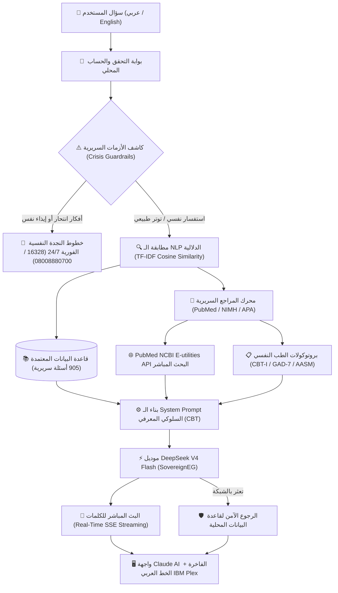

# 🧠 منصة Stress AI Helper — المساعد الذكي للدعم النفسي والاسترخاء
> **Bilingual Cognitive-Behavioral AI & Clinical Psychiatry Platform**  
> مدعوم بمحرك معالجة اللغة الطبيعية (NLP) + موديل **DeepSeek V4 Flash** + أبحاث الطب النفسي من **PubMed (NIH)**

---

## 🌟 نظرة عامة على المشروع (Executive Overview)

**Stress AI Helper** هو نظام ذكي متكامل للدعم النفسي وتخفيف التوتر، يجمع بين دقة قواعد البيانات النفسية المعتمدة (905 سؤال وجواب)، وقوة النماذج اللغوية الضخمة (**DeepSeek V4 Flash**)، والأبحاث الطبية المنشورة في **مكتبة الطب الوطنية الأمريكية (PubMed / NIH)**، مع واجهة مستخدم تحريرية فاخرة مستوحاة بالكامل من هوية **Anthropic Claude** بالخط العربي الأيقوني **IBM Plex Sans Arabic**.

---

## 🏛️ معمارية النظام (System Architecture)



---

## ✨ أبرز مميزات النظام (Key Features)

### 1. الذكاء الاصطناعي السريري والهجين (Hybrid AI & Clinical Engine)
* **محرك بحث دلالي فائق السرعة**: يعمل بتقنية `TF-IDF n-gram` ومطابقة جيب التمام (`Cosine Similarity`) مع مصفوفة من 905 سؤال وجواب معتمد في مجالات (القلق، التوتر، الأرق، صعوبات المذاكرة، وفقدان الشغف).
* **توليد مباشر بموديل DeepSeek V4 Flash**: صياغة ردود إنسانية، دافئة، وعملية مستندة إلى مبادئ العلاج المعرفي السلوكي (CBT).
* **البث المباشر للكلمات (Real-Time SSE Streaming)**: تدفق الكلمات لحظة بلحظة مع مؤشر كتابة نابض بلون التيراكوتا (`streaming-cursor`).
* **ذاكرة الحوار المستمر (Multi-turn Context Memory)**: يتذكر الموديل سياق الحوار وآخر رسائل متبادلة للرد بوعي تراكمي.

### 2. المرجعية الطبية وأبحاث PubMed (Authoritative Medical Grounding)
* **ربط مباشر مع PubMed / NCBI API**: يبحث النظام تلقائياً عن الأبحاث السريرية ويجلب كود البحث الدولي (`PubMed PMC ID`).
* **بروتوكولات سريرية معتمدة عالمياً**:
  * **القلق والهلع (Anxiety & Panic)**: إرشادات الجمعية الأمريكية للطب النفسي (APA) والمعهد القومي للصحة النفسية (NIMH).
  * **الأرق والنوم (Insomnia & Sleep)**: الدليل الإكلينيكي للأكاديمية الأمريكية لطب النوم (AASM).
  * **الإجهاد والتوتر (Stress & Vagal Tone)**: دليل منظمة الصحة العالمية (WHO mhGAP) ودراسات هارفارد.
  * **علاج الإدمان (Addiction Recovery)**: إرشادات NIDA وصندوق مكافحة وعلاج الإدمان (الخط الساخن 16023).
* **شارات المراجع الطبية في الواجهة (Clickable Clinical Badges)**: تظهر أسفل كل رد شارة موثقة بالمرجع الطبي وتفتح الورقة البحثية الأصلية بضغطة واحدة.

### 3. الأمان السريري والتدخل في الطوارئ (Clinical Safety Guardrails)
* كاشف فوري لأي أفكار انتحارية أو إيذاء نفس باللغتين العربية والإنجليزية.
* اعتراض فوري للاستفسار وتقديم أرقام الطوارئ والدعم النفسي المجاني على مدار 24 ساعة (خط الدعم النفسي في مصر `08008880700`، الأمانة العامة للصحة النفسية `16328`، الخط الدولي `988`).

### 4. الأدوات والخدمات التفاعلية (Interactive Wellness Tools)
* **🧘 تمرين التنفس (4-7-8 Breathing Tool)**: ويدجت تفاعلي دائري متحرك في الشريط الجانبي لتهدئة الجهاز العصبي ونوبات الهلع.
* **📝 الفحوصات والمقاييس النفسية المقننة (Clinical Assessments)**:
  * مقياس القلق المعمم (**GAD-7**).
  * مقياس شدة الأرق واضطرابات النوم (**ISI**).
  * تحليل فوري للدرجة وزر لمناقشة النتيجة مع الذكاء الاصطناعي.
* **🎧 صوتيات الاسترخاء والتركيز (Ambient Soundscapes)**:
  * مولدة مباشرة عبر **Web Audio API** بدون أي ملفات خارجية (مطر هادئ 🌧️، أمواج بحر 🌊، تردد ثيتا 432Hz التأملي 🧘).
* **🎙️ التحدث الصوتي (Speech-to-Text)**: إدخال صوتي بالعامية أو الفصحى أو الإنجليزية.
* **🔊 القراءة الصوتية (TTS)**: استماع للردود بنقرة واحدة عبر `window.speechSynthesis`.
* **📋 نسخ وتصدير المحادثات (Copy & Export)**: نسخ الرسائل بنقرة واحدة وتصدير المحادثة بالكامل كملف `Markdown (.md)`.

### 5. واجهة المستخدم وهوية كلود (Anthropic Claude Aesthetic)
* **لوحة الألوان الترابية الدافئة**: درجات الفحم الدافئ (`#1f1e1d` و `#272522`) مع لون التيراكوتا الأيقوني (`#cc785c`).
* **الخط العربي الفاخر**: خط **IBM Plex Sans Arabic** الأصلي بكافة أوزانه، بجانب خط **Newsreader Serif** للعناوين الإنجليزية.
* **نظام تسجيل الدخول والحسابات (Auth System)**: تسجيل دخول وإنشاء حساب وحفظ البيانات محلياً في المتصفح (`localStorage`) مع إمكانية تسجيل الخروج.
* **تجاوب كامل لكافة الشاشات (Full Responsiveness)**: هيدر مخصص للهواتف، وقائمة جانبية تنزلق بسلاسة كـ Off-canvas Drawer.

---

## 📂 هيكل المشروع (Project Directory Tree)

```text
frontend NLP project/
├── backend/
│   ├── data/
│   │   └── data.json              # قاعدة البيانات الأساسية (905 أسئلة وأجوبة معتمدة)
│   ├── routes/
│   │   └── predict.py             # مسارات الـ API (/predict, /predict/stream, /health)
│   ├── services/
│   │   ├── clinical_service.py    # محرك المراجع الطبية وربط PubMed / NIMH / WHO
│   │   ├── llm_service.py         # محرك DeepSeek V4 Flash، الأمان السريري، والبث SSE
│   │   └── model_service.py       # محرك الـ NLP الدلالي ومطابقة جيب التمام
│   ├── utils/
│   │   ├── preprocessing.py       # معالجة النصوص العربية، إزالة التشكيل، والكلمات الاستبعادية
│   │   └── vectorizer.py          # أدوات مصفوفات TF-IDF
│   ├── .env                       # متغيرات البيئة ومفاتيح الـ API السرية
│   ├── .env.example               # نموذج متغيرات البيئة الآمن للمشاركة
│   ├── main.py                    # تطبيق FastAPI، إعدادات CORS، وإدارة دورة الحياة
│   ├── requirements.txt           # متطلبات بايثون
│   └── test_api.py                # حزمة الاختبارات المؤتمتة الشاملة للباك إند
│
├── CHAT BOT/
│   ├── public/
│   │   └── fonts/                 # خطوط IBM Plex Sans Arabic المستخرجة محلياً
│   ├── src/
│   │   ├── components/
│   │   │   ├── AmbientSoundModal.jsx # مشغل صوتيات الاسترخاء الحي عبر Web Audio API
│   │   │   ├── AssessmentModal.jsx   # مقاييس القلق والأرق المقننة (GAD-7 & ISI)
│   │   │   ├── AuthPage.jsx          # صفحة تسجيل الدخول وإنشاء الحساب
│   │   │   ├── BreathingModal.jsx    # ويدجت تمرين التنفس المهدئ (4-7-8)
│   │   │   ├── ChatsPage.jsx         # شاشة إدارة وتصفح سجل المحادثات السابقة
│   │   │   ├── ChatWindow.jsx        # نافذة المحادثة، محرك Markdown، وشارات المراجع
│   │   │   ├── SearchModal.jsx       # نافذة البحث السريع بالمحادثات (Ctrl+K)
│   │   │   └── Sidebar.jsx           # القائمة الجانبية بنمط كلود، التمارين، والبروفايل
│   │   ├── App.jsx                   # إدارة الحالة المركزية، البث، والمصادقة
│   │   └── main.jsx                  # نقطة انطلاق تطبيق React
│   ├── index.html                 # ملف البداية واستيراد خط Newsreader
│   ├── package.json               # حزم الفرونت إند (React 19, Vite, Marked)
│   ├── style.css                  # نظام التصميم المتكامل (Tokens, Claude Theme, RTL)
│   └── vite.config.js             # إعدادات مجمع Vite
│
├── IBM_Plex_Sans_Arabic.zip       # حزمة الخط العربي الأصلية
├── run_project.bat                # مشغل التشغيل التلقائي بنقرة واحدة لنظام ويندوز
├── README.md                      # هذا الملف التوثيقي الشامل
└── .gitignore                     # استبعاد الحزم المؤقتة ومفاتيح البيئة
```

---

## 🚀 التشغيل السريع بنقرة واحدة (Quick Start)

على نظام تشغيل Windows، اضغط ضغطاً مزدوجاً على الملف:
```bat
run_project.bat
```
يقوم هذا السكربت تلقائياً بـ:
1. التحقق من تثبيت Python و Node.js.
2. تشغيل سيرفر الباك إند FastAPI على المنفذ `8000`.
3. تشغيل واجهة الفرونت إند Vite على المنفذ `5173`.
4. فتح الموقع مباشرة في متصفحك الافتراضي.

---

## 🛠️ التشغيل اليدوي (Manual Setup)

### 1. تشغيل الباك إند (Backend)
```bash
cd backend
python -m pip install -r requirements.txt
python -m uvicorn main:app --host 127.0.0.1 --port 8000 --reload
```
* **فحص الحالة**: `http://127.0.0.1:8000/health`
* **توثيق Swagger التفاعلي**: `http://127.0.0.1:8000/docs`

### 2. تشغيل الفرونت إند (Frontend)
```bash
cd "CHAT BOT"
npm install
npm run dev
```
* **رابط الموقع**: `http://127.0.0.1:5173`

---

## 🧪 فحص واختبار النظام (Automated Tests)

للتحقق من سلامة الباك إند، محرك الـ NLP، كاشف الأزمات، والاتصال الطبي:
```bash
python backend/test_api.py
```

لاختبار بناء حزمة الإنتاج للفرونت إند وضمان خلوه من أي أخطاء:
```bash
cd "CHAT BOT"
npm run build
```

---

## 📡 واجهات الـ API (API Endpoints)

### 1. التدفق الحي بالذكاء الاصطناعي والمراجع السريرية:
`POST /predict/stream`
* **نوع البيانات**: `text/event-stream` (Server-Sent Events)
* **المدخلات**:
```json
{
  "text": "مش عارف أنام وعندي أرق وتفكير مفرط",
  "topic": "sleep",
  "history": [
    { "role": "user", "content": "أنا قلقان من بكرة" },
    { "role": "assistant", "content": "سلامتك، أنا جنبك وواثق فيك." }
  ]
}
```
* **المخرجات المتدفقة**:
  * قطع النصوص: `data: {"delta": "سلامتك.. "}`
  * البيانات الطبية المعتمدة:
```json
data: {
  "meta": {
    "topic": "sleep",
    "confidence": 0.95,
    "enhanced_by_ai": true,
    "clinical_reference": {
      "source": "الأكاديمية الأمريكية لطب النوم (AASM)",
      "title": "الدليل الإكلينيكي لعلاج الأرق السلوكي المعرفي (CBT-I)",
      "citation": "AASM / Ann Intern Med (PubMed PMC ID: 13530075)",
      "url": "https://www.ncbi.nlm.nih.gov/pmc/articles/PMC13530075/"
    }
  }
}
data: [DONE]
```

### 2. فحص حالة السيرفر:
`GET /health`
* **المخرجات**:
```json
{
  "status": "ok",
  "dataset_size": 905,
  "vectorizer_ready": true,
  "available_topics": ["anxiety", "motivation", "sleep", "stress", "study"],
  "llm_enabled": true,
  "clinical_service_ready": true
}
```

---

## 🔒 الأمان وحماية البيانات (Security Best Practices)

1. **حفظ المفاتيح في الباك إند**: مفتاح DeepSeek ومسارات الـ API محفوظة حصراً داخل `backend/.env` ولا تتسرب مطلقاً لكود المتصفح أو للعموم.
2. **الخصوصية المحلية**: المحادثات وسجل الحسابات مشفرة وتُحفظ محلياً على جهاز المستخدم عبر `localStorage`.
3. **التشخيص الطبي**: التطبيق يقدم نصائح دعم نفسي سلوكي معرفي (Psychoeducation) ولا يصف أدوية كيميائية، مع توجيه الحالات الحرجة فوراً للخطوط الساخنة والمستشفيات المعتمدة.

---

## 📄 الترخيص (License)
هذا المشروع مصمم ومطور لأغراض الدعم النفسي والتعليمي والبحث العلمي في الذكاء الاصطناعي ومعالجة اللغات الطبيعية (NLP).
